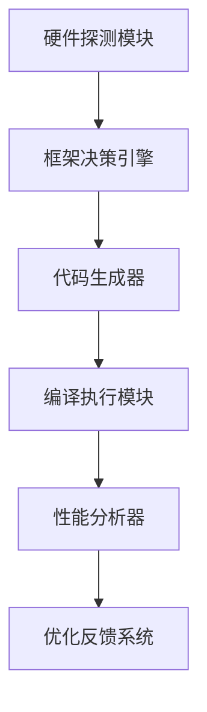

+ 套用现有的任务模版
+ 
| 任务类型       | 任务举例                  | 框架选择建议          |
|----------------|--------------------------|---------------------|
| 计算密集型 |    矩阵运算 |  CUDA、cuDNN、OpenCL      |
| 访存密集型  |   数组排序或者求和    |OpenMP、Intel TBB、CUDA |
| 通信密集型  |   BFS         |  MPI、NCCL、Ray、Horovod     |

