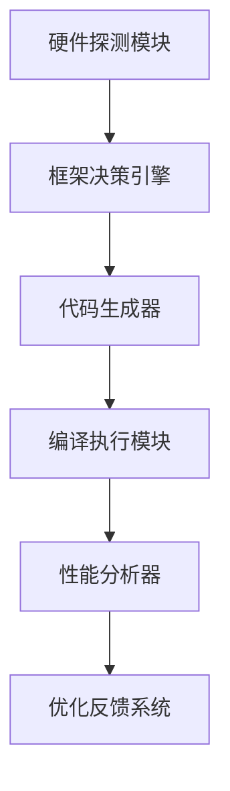

+ 套用现有的任务模版
+ 
| 任务类型       | 任务举例                  | 框架选择建议          |
|----------------|--------------------------|---------------------|
| 计算密集型 |    矩阵运算 |  CUDA、cuDNN、OpenCL      |
| 访存密集型  |   数组排序或者求和    |OpenMP、Intel TBB、CUDA |
| 通信密集型  |   BFS         |  MPI、NCCL、Ray、Horovod     |

数据量大使用通信式
设定硬件条件

注意给定函数签名，生成头文件之后再共同编译
预先写好测试文件

使用什么准则进行测试。速度 两到三次 三种平台的时间
时间 正确性 
有GPU CPU核多 CPU核少但是频率高

mpi 先不管 
CSR 格式图
增大数据规模 
比对bfs结果